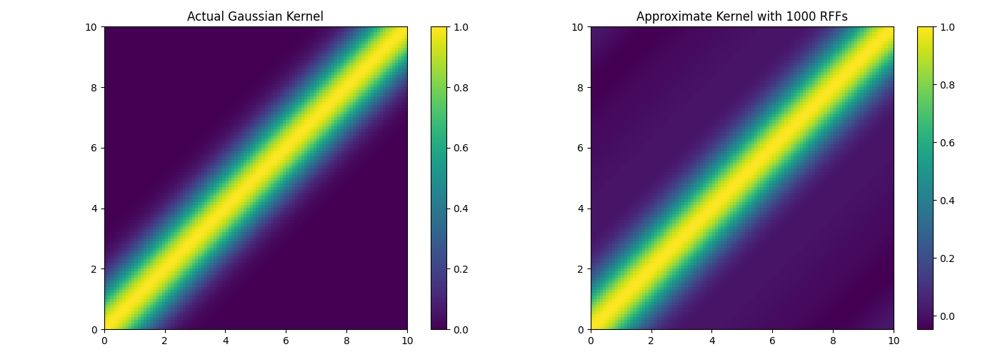
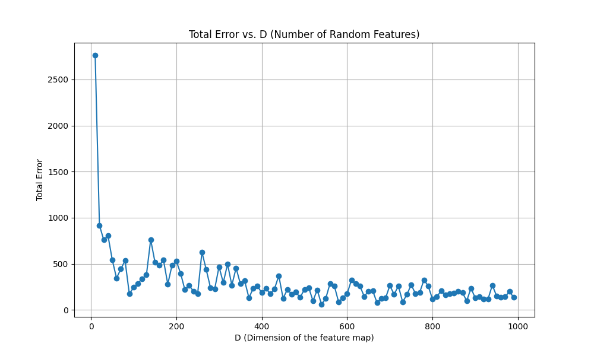
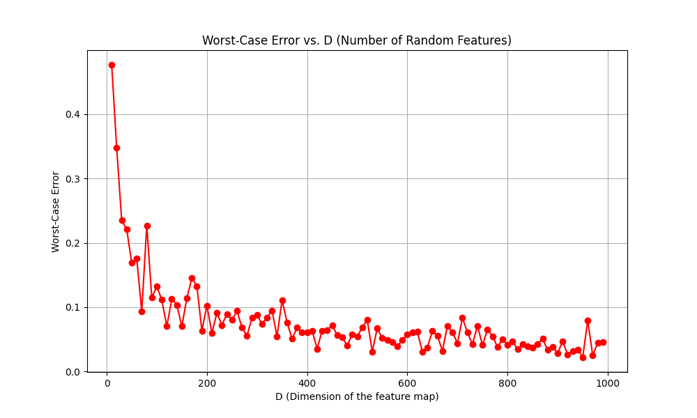

# Random Features for Large-Scale Kernel Machines (2007 Rahimi & Recht)

This repository contains a detailed review, summary, and implementation of the Random Fourier Features (RFF) method as introduced by Ali Rahimi and Benjamin Recht in their influential 2007 paper published in the proceedings of the Advances in Neural Information Processing Systems (NIPS). The original paper is available [here](https://people.eecs.berkeley.edu/~brecht/papers/07.rah.rec.nips.pdf).

## Repository Structure

```
2007_RahimiRecht_RandomFeaturesKernel
├── LICENSE
├── README.md
├── RFF.ipynb
├── paper_summary.pdf
├── presentation.pdf
├── rff_error.png
├── rff_kernel.png
└── rff_worst_case_error.png
```

## Paper Summary

The paper "Random features for large-scale kernel machines" by Rahimi and Recht proposes an approach to approximate the feature map of a kernel function efficiently, enabling the application of kernel methods to large-scale problems. The method is particularly well-suited for shift-invariant kernels and allows the application of linear learning algorithms to nonlinear problems using kernel methods.

For a detailed summary, see `paper_summary.pdf` in this repository.

## Implementation and Code

The Jupyter notebook `RFF.ipynb` includes a Python implementation of the RFF algorithm along with a demonstration of how it approximates the Gaussian kernel. It also contains visualizations of the actual vs. approximate kernels and an analysis of the convergence of the total and worst-case errors.

You can view and run the notebook directly in Google Colab:
- 📔 [RFF](https://colab.research.google.com/github/rfarell/2007_RahimiRecht_RandomFeaturesKernel/blob/main/RFF.ipynb)


## Visualizations

The repository includes the following visualizations generated from the code:

- `rff_kernel.png`: Heatmaps of the actual and approximate Gaussian kernels
- `rff_kernel_slice.png`: Overlay of a kernel slice for direct comparison
- `rff_kernel_2d.png`: Visualization of the 2‑D kernel approximation
- `rff_error.png`: Total Error vs. D (Number of Random Features)
- `rff_worst_case_error.png`: Worst-Case Error vs. D (Number of Random Features)







<!-- ## Presentation

A YouTube presentation that walks through the concepts and findings of this research can be found here: [RFF Presentation](https://www.youtube.com/watch?v=AayZuuDDKP0) -->
